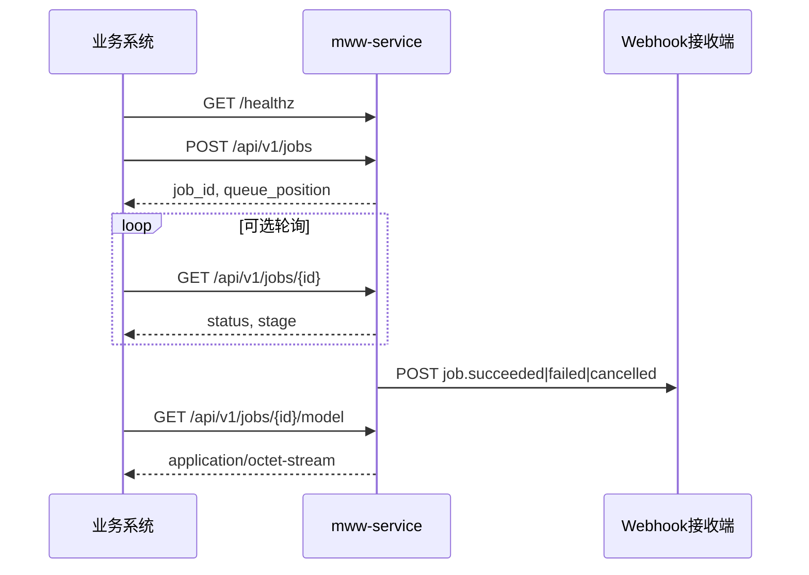

# microWakeWord 定制训练服务 — Integration Guide

面向业务系统接入的 HTTP API 说明。服务串行（FIFO）训练自定义唤醒词，产出量化后的 `.tflite` 模型。

进程监听 `0.0.0.0:6006`。业务侧经 Tailscale 访问（需在同一 tailnet）：

| 项 | 值 |
|----|----|
| Base URL | `http://mww-autodl.bunny-grouse.ts.net:6006` |
| Tailscale IPv4 | `100.120.96.27` |
| OpenAPI | `{BASE}/docs`、`{BASE}/openapi.json` |

---

## 1. 概述

| 项 | 说明 |
|----|------|
| 协议 | HTTP/JSON |
| 并发模型 | **单 worker 串行**：同一时刻只跑一个训练任务，其余排队 |
| 产物 | 量化 streaming TFLite（`*.tflite`） |
| 中文唤醒词 | 支持；内部 slug 由拼音生成（如 `嘿，龙虾宝宝` → `hei_long_xia_bao_bao`） |
| 启停 | `scripts/mww-service.sh {start\|stop\|restart\|status}` |



---

## 2. 快速开始

```bash
BASE=http://mww-autodl.bunny-grouse.ts.net:6006
# 若服务配置了 MWW_API_KEY，则所有 /api/v1/* 需带此头：
# HDR=(-H "X-API-Key: $MWW_API_KEY")

curl -sS "$BASE/healthz"

JOB=$(curl -sS -X POST "$BASE/api/v1/jobs" \
  -H "Content-Type: application/json" \
  "${HDR[@]}" \
  -d '{"wakeword":"嘿，龙虾宝宝","metadata":{"order_id":"demo-1"}}')
echo "$JOB"
JOB_ID=$(echo "$JOB" | python3 -c "import sys,json; print(json.load(sys.stdin)['job_id'])")

# 轮询直到终态
while true; do
  R=$(curl -sS "${HDR[@]}" "$BASE/api/v1/jobs/$JOB_ID")
  STATUS=$(echo "$R" | python3 -c "import sys,json; print(json.load(sys.stdin)['status'])")
  STAGE=$(echo "$R" | python3 -c "import sys,json; print(json.load(sys.stdin).get('stage'))")
  echo "status=$STATUS stage=$STAGE"
  case "$STATUS" in succeeded|failed|cancelled|interrupted) break ;; esac
  sleep 10
done

# 仅 succeeded 时可下载
curl -fsS "${HDR[@]}" -o hei_long_xia_bao_bao.tflite \
  "$BASE/api/v1/jobs/$JOB_ID/model"
```

更稳妥的方式是创建任务时带上 `webhook_url`，由服务在结束时回调，再按需拉模型。

---

## 3. 鉴权

| 场景 | 行为 |
|------|------|
| 未设置 `MWW_API_KEY` | `/api/v1/*` **开放**（适合内网） |
| 已设置 `MWW_API_KEY` | 请求须带请求头 `X-API-Key: <与环境变量相同的值>`，否则 `401` |
| `GET /healthz` | **始终免鉴权**（可供探活 / 负载均衡） |

Webhook 另有可选 HMAC，见 [§6](#6-webhook)。

---

## 4. API 一览

### 4.1 端点

| Method | Path | 鉴权 | 说明 |
|--------|------|------|------|
| `GET` | `/healthz` | 否 | 健康检查与队列概况 |
| `POST` | `/api/v1/jobs` | 有条件 | 创建训练任务 |
| `GET` | `/api/v1/jobs` | 有条件 | 列出任务 |
| `GET` | `/api/v1/jobs/{job_id}` | 有条件 | 查询单个任务 |
| `GET` | `/api/v1/jobs/{job_id}/logs?tail=` | 有条件 | 训练日志尾部（`tail` 默认 100，范围 1–5000） |
| `GET` | `/api/v1/jobs/{job_id}/model` | 有条件 | 下载 `.tflite`（仅 `succeeded`） |
| `DELETE` | `/api/v1/jobs/{job_id}` | 有条件 | 取消排队中或运行中的任务 |

### 4.2 `POST /api/v1/jobs` 请求体

| 字段 | 类型 | 必填 | 约束 / 默认 |
|------|------|------|-------------|
| `wakeword` | string | 是 | 1–64 字符；首尾空白会 trim，空串 → `400` |
| `webhook_url` | string (URL) | 否 | 任务结束时 POST 回调 |
| `training_steps` | int | 否 | 100–200000；省略则用服务默认（通常 `10000`） |
| `max_samples` | int | 否 | 20–5000；省略则用服务默认（通常 `400`） |
| `metadata` | object | 否 | 任意 JSON 对象，原样存贮并在查询/Webhook 中回传 |

**响应 `CreateJobResponse`：**

```json
{
  "job_id": "9f71a78cd82e",
  "status": "queued",
  "queue_position": 1,
  "slug": "hei_long_xia_bao_bao"
}
```

`queue_position`：排队位次（1-based）。若立刻成为当前任务，创建后很快会变为 `running`。

### 4.3 `JobResponse` 主要字段

| 字段 | 说明 |
|------|------|
| `job_id` | 任务 ID |
| `wakeword` / `slug` | 原文与文件系统友好 slug |
| `status` | 见 [§5](#5-任务生命周期) |
| `stage` | 流水线阶段名 |
| `queue_position` | `queued` 时为位次；`running` 为 `0`；终态为 `null` |
| `created_at` / `started_at` / `finished_at` | ISO-8601 时间 |
| `duration_seconds` | 自 `started_at` 起的秒数（运行中也会增长） |
| `error` | 失败/中断等原因 |
| `model_path` | 服务器本地绝对路径（成功时） |
| `model_url` | **相对路径** `/api/v1/jobs/{job_id}/model`（成功时）；需自行拼接服务 Base URL |
| `webhook_url` / `metadata` | 创建时传入的值 |
| `training_steps` / `max_samples` | 实际采用的参数 |

### 4.4 `GET /healthz`

```json
{
  "status": "ok",
  "gpu_available": true,
  "gpu_name": "NVIDIA GeForce RTX 4090 D",
  "queue_length": 0,
  "current_job_id": null,
  "workspace": "/root/autodl-tmp/mww"
}
```

### 4.5 HTTP 错误码

| Code | 含义 |
|------|------|
| `400` | `wakeword` 无效（例如 trim 后为空） |
| `401` | API Key 不匹配（仅当配置了 `MWW_API_KEY`） |
| `404` | 任务不存在；或模型文件在磁盘上缺失 |
| `409` | 下载模型时任务未成功结束，或尚无 `model_path` |

---

## 5. 任务生命周期

### 5.1 Status

```
queued → running → succeeded
                 → failed
                 → cancelled
                 ↘ interrupted   （进程级：服务重启时原 running 被标记，不会自动重跑）
```

| status | 含义 |
|--------|------|
| `queued` | 已入队，等待前序任务 |
| `running` | 正在训练 |
| `succeeded` | 成功，可下载模型 |
| `failed` | 失败，见 `error` |
| `cancelled` | 用户取消（排队直接取消，或运行中打断） |
| `interrupted` | 服务重启时仍在 `running`；**不会**发 Webhook，需业务侧自行处理 |

服务启动时：仍为 `queued` 的任务会重新进入内存队列；原 `running` 会被标为 `interrupted`。

### 5.2 Stage（进度）

Worker 先置 `starting`，随后 pipeline 大致顺序：

`synthesize` → `negatives` → `features` → `configure` → `train` → `export` → `done`

成功结束时 store 中 `stage` 为 `done`。可用 `stage` 做 UI 进度条，但以 `status` 作为终态判断依据。

### 5.3 取消

`DELETE /api/v1/jobs/{job_id}`：

- **queued**：立即 `cancelled`，移出队列
- **running**：写入取消标记并终止训练子进程，最终多为 `cancelled`
- 已终态：返回当前记录，不改变状态

---

## 6. Webhook

创建任务时传入 `webhook_url`，仅在任务 **结束**（`succeeded` / `failed` / `cancelled`）时 POST 一次。`interrupted` **不**触发。

### 6.1 请求特征

| 项 | 值 |
|----|-----|
| Method | `POST` |
| Content-Type | `application/json; charset=utf-8` |
| User-Agent | `microwakeword-service/1.0` |
| 成功判定 | HTTP 2xx |
| 超时 | `MWW_WEBHOOK_TIMEOUT_S`（默认 15s） |
| 重试 | 最多 `MWW_WEBHOOK_MAX_RETRIES`（默认 3）次；间隔 `2^(attempt-1)` 秒（1s、2s…） |
| 签名（可选） | 若配置 `MWW_WEBHOOK_SECRET`，带头 `X-MWW-Signature: <hmac-sha256-hex>` |

签名算法：对 **原始请求 body 字节** 做 HMAC-SHA256，密钥为 `MWW_WEBHOOK_SECRET`，结果为小写 hex。

### 6.2 Payload 示例

```json
{
  "event": "job.succeeded",
  "job_id": "9f71a78cd82e",
  "wakeword": "嘿，龙虾宝宝",
  "slug": "hei_long_xia_bao_bao",
  "status": "succeeded",
  "error": null,
  "model_path": "/root/autodl-tmp/mww/output/hei_long_xia_bao_bao.tflite",
  "duration_seconds": 764,
  "metadata": {"order_id": "demo-1"}
}
```

`event` 为 `job.{status}`，例如 `job.failed`、`job.cancelled`。  
`model_path` 是 **训练机本地路径**；跨主机集成请用 `GET /api/v1/jobs/{job_id}/model` 拉取文件。

### 6.3 验签伪代码（Python）

```python
import hashlib
import hmac

def verify_mww_signature(body: bytes, secret: str, signature_header: str) -> bool:
    expected = hmac.new(secret.encode("utf-8"), body, hashlib.sha256).hexdigest()
    return hmac.compare_digest(expected, signature_header or "")
```

接收端应：先读 raw body → 验签 → 再 `json.loads`；用 `metadata` / `job_id` 关联业务订单。

---

## 7. 集成建议

1. **优先 Webhook + 兜底轮询**：回调失败时服务只重试有限次数，业务侧应对 `job_id` 做超时轮询（建议间隔 10–30s）。
2. **串行队列**：`queue_length` / `queue_position` 反映积压；高峰请限流或向用户展示预计等待。
3. **`metadata`**：放入订单号、用户 ID 等，Webhook 原样回传，避免自建 job_id 映射表时丢关联。
4. **`model_url`**：响应里是相对路径；完整地址为 `{BASE}{model_url}`，例如 `http://mww-autodl.bunny-grouse.ts.net:6006/api/v1/jobs/xxx/model`。
5. **超时与取消**：端到端默认配置常见约十余分钟（视 GPU）；超时后对仍 `queued`/`running` 的任务发 `DELETE`，并处理最终 `cancelled`/`failed`。
6. **探活**：负载均衡 / K8s 用 `GET /healthz`；不要把「排队非空」当成不健康。
7. **安全**：公网务必设置 `MWW_API_KEY` 与 `MWW_WEBHOOK_SECRET`；Webhook URL 使用 HTTPS。

---

## 8. 客户端示例

### 8.1 完整 curl（含可选 Webhook）

```bash
BASE=http://mww-autodl.bunny-grouse.ts.net:6006
API_KEY="${MWW_API_KEY:-}"
AUTH=()
[[ -n "$API_KEY" ]] && AUTH=(-H "X-API-Key: $API_KEY")

curl -sS -X POST "$BASE/api/v1/jobs" \
  -H "Content-Type: application/json" \
  "${AUTH[@]}" \
  -d '{
    "wakeword": "嘿赛赛猫",
    "training_steps": 10000,
    "max_samples": 400,
    "webhook_url": "https://example.com/hooks/mww",
    "metadata": {"source": "crm", "order_id": "A10086"}
  }'
```

### 8.2 Python（创建 + 轮询 + 下载）

```python
import time
import requests

BASE = "http://mww-autodl.bunny-grouse.ts.net:6006"
HEADERS = {"X-API-Key": "your-secret"}  # 未启用鉴权时可省略

r = requests.post(
    f"{BASE}/api/v1/jobs",
    headers=HEADERS,
    json={"wakeword": "嘿，龙虾宝宝", "metadata": {"order_id": "A10086"}},
    timeout=30,
)
r.raise_for_status()
job_id = r.json()["job_id"]

while True:
    job = requests.get(f"{BASE}/api/v1/jobs/{job_id}", headers=HEADERS, timeout=30).json()
    if job["status"] in ("succeeded", "failed", "cancelled", "interrupted"):
        break
    time.sleep(10)

if job["status"] != "succeeded":
    raise RuntimeError(job.get("error") or job["status"])

model = requests.get(f"{BASE}/api/v1/jobs/{job_id}/model", headers=HEADERS, timeout=120)
model.raise_for_status()
open(f"{job['slug']}.tflite", "wb").write(model.content)
```

### 8.3 Node.js（创建 + 轮询）

```javascript
const BASE = "http://mww-autodl.bunny-grouse.ts.net:6006";
const headers = { "Content-Type": "application/json", "X-API-Key": "your-secret" };

async function train(wakeword) {
  const created = await fetch(`${BASE}/api/v1/jobs`, {
    method: "POST",
    headers,
    body: JSON.stringify({ wakeword, metadata: { order_id: "A10086" } }),
  }).then((r) => r.json());

  const jobId = created.job_id;
  for (;;) {
    const job = await fetch(`${BASE}/api/v1/jobs/${jobId}`, { headers }).then((r) =>
      r.json()
    );
    if (["succeeded", "failed", "cancelled", "interrupted"].includes(job.status)) {
      if (job.status !== "succeeded") throw new Error(job.error || job.status);
      const bin = await fetch(`${BASE}/api/v1/jobs/${jobId}/model`, { headers }).then((r) =>
        r.arrayBuffer()
      );
      return { job, bytes: Buffer.from(bin) };
    }
    await new Promise((r) => setTimeout(r, 10000));
  }
}
```

---

## 9. 部署侧环境变量（摘要）

业务对接通常只需关心鉴权与 Webhook；训练默认值影响耗时与质量。

| 环境变量 | 默认 | 说明 |
|----------|------|------|
| `MWW_HOST` / `MWW_PORT` | `0.0.0.0` / `6006` | 监听地址 |
| `MWW_WORKSPACE` | `/root/autodl-tmp/mww` | 任务与产物工作区 |
| `MWW_ASSETS_DIR` | `/root/autodl-tmp/assets` | Piper 与负样本资源 |
| `MWW_API_KEY` | 空 | 非空则启用 `X-API-Key` |
| `MWW_WEBHOOK_SECRET` | 空 | 非空则 Webhook 带 `X-MWW-Signature` |
| `MWW_WEBHOOK_MAX_RETRIES` | `3` | 回调重试次数 |
| `MWW_WEBHOOK_TIMEOUT_S` | `15` | 单次回调超时（秒） |
| `MICROWAKEWORD_TRAINING_STEPS` | `10000` | 创建任务未指定时的 steps |
| `MICROWAKEWORD_SAMPLE_COUNT` | `400` | 创建任务未指定时的正样本数 |
| `MICROWAKEWORD_TRAIN_BATCH` | `256` | 训练 batch |

运维启停见 [`scripts/mww-service.sh`](../scripts/mww-service.sh)。GPU / CUDA / CuDNN 细节不在本指南范围。

---

## 10. 限制与预期

- **串行**：无法并行训练多个唤醒词；队列会线性堆积。
- **默认参数**（约 400 正样本、1 万 steps）是服务化「快训」配置；在具备 GPU 时端到端常见约 **十余分钟** 量级，随机器与队列变化。
- 该默认配置 **不等同** 上游社区「可用模型」常用量级（往往更多样本与更多 steps、总时长更长）。若业务要更高召回/更低误触发，需自行加大 `max_samples` / `training_steps` 并接受更长排队与训练时间。
- 训练过程中服务进程应保持存活；重启会把当时的 `running` 标为 `interrupted`。
- 模型面向 ESPHome / micro_wake_word 等场景；上线前请在真实设备上调阈值与验证误报。

---

## 相关文件

| 路径 | 内容 |
|------|------|
| `microwakeword/service/app.py` | 路由与鉴权 |
| `microwakeword/service/schemas.py` | 请求/响应模型 |
| `microwakeword/service/webhook.py` | 回调投递与签名 |
| `microwakeword/service/config.py` | 环境变量加载 |
| `scripts/mww-service.sh` | 服务启停 |
